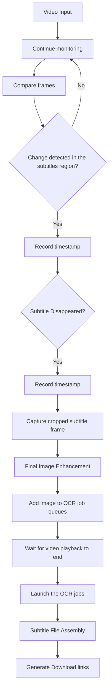

# Technical Specification: Video Subtitle Extractor SPA

## I: Functionalities

### Core Functionality

This in-browser web application (SPA) provide an interactive tool to extract hardcoded subtitles from video files through an automated browser-based pipeline:
* Select a local or external video to load + define the crop subtitles region
* Play the video with frame buffering and image processing to isolate the subtitles text
* Take automated snapshots of the subtitles crop region when a new subtitle appear
* Launch the OCR jobs on the list of snapshots
* Gather all recognized text to generate the final downloadable subtitle files (`.srt`, `.vtt`)

### Detailed key features

#### 1. Choice of Video Sources
- Upload local video files via drag-and-drop/file selection
- -OR- provide some external video source URLs (must be CORS-enabled)
- Supported web standard formats: MP4, WebM (compatible with the `<video>` tag)

#### 2. Video Processing Pipeline

- User-defined cropping area for the subtitle region
- Image pre-processing:
  - Color quantization (reduce the palette to enhance contrast and separation)
- Eliminations of artifacts by using motion detection :
  - Use a frame buffer to store the 5 last frames
  - Isolate stable subtitles from moving backgrounds (eliminate the area where motion has been detected)
- - Binarization (black/white conversion) before OCR submit

#### 3. Event Detection & Capture

- Detect the appearance/disappearance of a new subtitle (save timestamp)
- Take an automatic snapshot of the motion filtered subtitle when on its last appearance (only one snapshot per unique subtitle + perfect timestamps)

#### 4. Text Recognition

* In-browser multi-language OCR tool: (Tesseract.js)
* -OR- external API calls to Google OCR or other services
* Several OCR workers can work in parallel on the submitted vignettes

#### 5. Generation of subtitle files
- Gather all recognized text with their timestamps (see event detections)
- Clean the global transcription with an AI engine
- One-click to download the generated file formats: `.srt`, `.vtt`

#### Functional Flow



## II. Technical Insights

### Video manipulation through Canvas

The technique is exposed in various articles like : 
* [Manipulating videos using canvas](https://developer.mozilla.org/en-US/docs/Web/API/Canvas_API/Manipulating_video_using_canvas)

The idea is to load the selected video into a `<video>` element and to register an event listener on the `play` event on that element.
When the `play` event occurs, it is possible to copy each video frames to a first `<canvas>` element.
That initial canvas element has an **API** to access the data of each frame and this will allow us to buffer and process each images
before displaying the final result into a second canvas element.

### Creating a frame buffer

We need a stack of frames to be able to detect motion in the video. Lets say we keep 5 frames in this stack.
Each time a new frame is captured we should remove the oldest one, apply the usual _color palette reduction_ to the new one before adding it to the stack. Frames are wrappers around the `ImageData` object.

### Color palette reduction

We can use our knowledge of the subtitles colors that will usually be fixed. We ask the user to select the two colors of the subtitles and we store them.
The first image processing step is a specific filter that reduces the number of colors of the original palette. 
The pinned subtitles colors should be kept _as is_ or even transmuted to pure black and white (for the fill and stroke color of the subtitles).
Meanwhile, all other colors should be attenuated in contrast. 
Because the background video contains colors, all pixel with a hue should be directed to a new monochromatic color space with reduced contrast. This should allow us to observe hyper contrasted subtitles letters in front of faded monochromatic moving images in background. 
These moving pixels will then be erased by the _motion detection_ leaving only a white background if the image is in movement.

### Motion detection

From a 5 frames buffer we are able to extract a new image where any pixel that has seen movement (color changes) over the last buffered frames should be erased.
During that phase, the subtitles should remain because they are static and they usually last for 1 or 2 straight seconds..
This final image is send to the second <canvas> element.

### Event detection on the second Canvas element

By listening to sudden change in the rectangular area where subtitles should appear, we can note the timestamp of appearance and disappearnce of new subtitles. We could count the number of pixels belonging to the specific subtitles colors to detect this change and know if there is a subtitle displayed.
When a change occurs, it is time to decide if we take a snapshot of the previous displayed subtitle and push it with its start and end time or id we drop the snapshot (no subtitle detected). 
When a subtitle snapshot is identified it can be further processed and ideally should only contain some black text over a white background. This snapshot and its timestamps are then added to the OCR job queue.

When the video has stopped playing we are ready to start the OCR jobs whose result should allow us to build a complete `.srt` file with correct timestamps and decoded text.

## Utilities (Design First Approach)

The complex image processing and chain of events we have to handle is a very serious motive to take the most scrupulous clean code and test driven approach.
We will define the contract for our high level APIs and make sure that these contracts are totally fine by writing the unit tests for all these classes or libraries of functions.
This will ensure that we are able to assemble all this components from bottom to top in the final page with a clean separation of concerns.

Here is a first draft of the various objects that could make our live easier.

### the Frame and FrameBuffer

```typescript

/**
 * This represent the three composants of a pixel
 * in the RGB color space
 */
type RgbVector = [number, number, number];
/**
 * Same with opacity (alpha channel)
 */
type RgbaVector = [number, number, number, number];

/**
 * Struturally, a rgb or hsl vector are the same
 * but the values belong to different color space
 */
type HslVector = RgbVector;
type HslaVector = RgbaVector;

/**
 * A frame is an array of rgba values
 * It a wrapper around the web standard ImageData with some utility methods added
 * to convert values between the RGB and HSL color space
 * @see https://developer.mozilla.org/fr/docs/Web/API/ImageData
 */
interface Frame extends ImageData {

    /**
     * Get the RGB value at pixel position [x, y]
     */
    getRgbPixel(x, y): RgbVector;

    /**
     * Get the RGBA value at pixel position [x, y]
     */
    getRgbaPixel(x, y): RgbaVector;

    /**
     * Get the HSL value at pixel position [x, y]
     */
    getHslPixel(x, y): HslVector;

    /**
     * Get the HSLA value at pixel position [x, y]
     */
    getHslaPixel(x, y): HslaVector;

    /**
     * Define the new RGB value for the pixel [x,y] 
     */
    setPixelRgb(x: number, y: number, rgb: RgbVector): void;

    /**
     * Define the new RGBA value for the pixel [x,y] 
     */
    setPixelRgba(x: number, y: number, rgba: RgbaVector): void;

    /**
     * Define the new HSL value for the pixel [x,y] 
     */
    setPixelHsl(x: number, y: number, hsl: RgbVector): void;

    /**
     * Define the new HSLA value for the pixel [x,y] 
     */
    setPixelHsla(x: number, y: number, hsla: RgbaVector): void;

    /**
     * Create a copy of the current Frame
     */
    clone(): Frame;

    /**
     * This filter is applied to the current frame
     */
    applyFilter(filter: ((x: number, y: number, rgba: RgbaVector) => RgbaVector)): Frame;

};

class FrameBuffer() {

    /**
     * Instanciate a new empty frame buffer with a maximum `size` 
     * for frames of `width` x `height` size 
     */ 
    constructor(width: number, height: number, size: number);

    /**
     * Add a new frame at index 0, drop the last one if the buffer is filled (FIFO)
     */
    addFrame(frame: Frame);

    /**
     * Get the frame at index 
     */
    getFrame(index: number): Frame;

    /**
     * Ready when the number of frames is equal to count
     */
    get isReady(): boolean;

    /**
     * The current length of the buffer (number of frames added)
     */
    get length(): number;

    /**
     * Get the RGB value for pixel at position [x, y] in frame z
     */
    getRgbPixel(x, y, z): RgbVector;

    getRgbaPixel(x, y, z): RgbaVector;
    getHslPixel(x, y, z): HslVector;
    getHslaPixel(x, y, z): HslaVector;

    /**
     * Look at each pixel at position [x, y] inside the frame buffer
     * starting with oldest frame. 
     * If the pixel color has changed between frames add a score of 100 / (capacity-1)
     * For instance, if the number of frames is 5, we add score of 20 every time the pixel changes color
     * At the end if the pixel has changed colors on each frame the returned score should be 100
     * If the pixel didn't change color the returned score should be zero
     * @param x horizontal position [0, width]
     * @param y vertical position [0, height]
     * @param threshold minimal distance from the previous color that count as a change
     */
    detectMotion(x: number, y: number, threshold: number): number;

    /**
     * Iterate over the available frames
     */
    forEach(cb: (frame: Frame, index: number) => void);

}
```

### Image filters

We could rely if possible on an existing library or we should just adapt some of the most common algorithms for image manipulation : 

This filters can be added to the Frame interface making it very easy to get a new frame by the application of a filter.

#### Quantization

Reduce the color palette.
There is a twist in our approach : 
We have a short list of colors (those used to print the subtitles on-screen) that we want to isolate from the crowd. For these colors we will use a table of conversion. A certain threshold is given to accept a range of colors in input that will match these targets.
For the rest of the colours will follow a different algorithm : contrast decrease, posterization...

```typescript

type ImageFilter: ()

/**
 * Create a quantization filter
 */
quantize(opts: quantizeOptions): Filter;
```

### The Subtitles

```typescript
interface SubtitleEntry {
    /**
     * Start time in milliseconds
     */
    start: number;
    /**
     * End time in milliseconds
     */
    end: number;
    /**
     * Subtitle text
     */
    text: string;
    constructor(start: number, end: number, text: string);
    /**
     * Shift subtitle by amount (ms), throws if negative
     */
    moveBy(amount: number): void;
    /**
     * Set end = start + duration, throws if negative
     */
    updateDuration(duration: number): void;
    /**
     * SRT formatted subtitle entry
     */
    toSRT(index: number): string;
    /**
     * VTT formatted subtitle entry
     */
    toVTT(): string;
}
```

## Technnical stack

A modern front-end only SPA written in Typescript

* Runtime: [bun](https://bun.sh/) (replace altogether nodeJS, Vitest and the package manager)
* Bundler and dev server: [bun](https://bun.sh/) (until we nedd [Vite.js](https://vite.dev/))
* Linting/Formatting: [BiomeJS](https://biomejs.dev/)
* Git actions for automatic CI/CD on `git push`
* Most modern browsers only (ESNext) : ESM, Canvas, Web workers, ...

### Libraries: 

* In browser OCR: [Tesseract.js]() (WASM)
* In-browser image manipulation (color manipuilation, distance, some filters): [Chroma](https://gka.github.io/chroma.js)

### Deployment

Hosting: ready to deploy button for 
* Vercel
* Cloudflare Pages
* AppWrite
